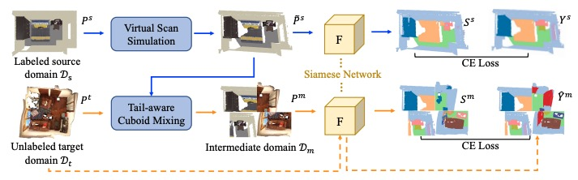

# DODA

**Data-oriented Sim-to-Real Domain Adaptation for 3D Semantic Segmentation (ECCV 2022)**



**Authors**: Runyu Ding\*, Jihan Yang\*, Li Jiang, Xiaojuan Qi  (\* equal contribution)

[arXiv](https://arxiv.org/abs/2204.01599)


## Introduction
 In this work, we propose a Data-Oriented Domain Adaptation (DODA) framework on sim-to-real domain adaptation for 3D indoor semantic segmentation. Our empirical studies demonstrate two unique challengeds in this setting: the  point pattern gap and the context gap caused by different sensing mechanisms and layout placements across domains. Thus, we propose virtual scan simulation to imitate real-world point cloud patterns and tail-aware cuboid mixing to alleviate the interior context gap with a cuboid-based intermediate domain. The first unsupervised sim-to-real adaptation benchmark on 3D indoor semantic segmentation is also built on 3D-FRONT, ScanNet and S3DIS along with 8 popular UDA methods. 

## Installation
Please refer to [INSTALL.md](docs/INSTALL.md) for the installation.


## Getting Started
Please refer to [GETTING_STARTED.md](docs/GETTING_STARTED.md) to learn more usage.

#### Supported features and ToDo List
- [x] Release code
- [x] Support pre-trained model
- [ ] Support other baseline methods

## ModelZoo

#### 3D-FRONT -> ScanNet

| method | mIoU | download |
|:------:|:--:|:--:|
| DODA (only VSS) |40.52 |[model](https://connecthkuhk-my.sharepoint.com/:u:/g/personal/u3007346_connect_hku_hk/EX03cKbrOPtJoLF9w4bkOb0B_8sTN3ZOHxKviriUxUuOJg?e=w1bCRA) |
| DODA |51.33 | [model](https://connecthkuhk-my.sharepoint.com/:u:/g/personal/u3007346_connect_hku_hk/EXX9lYmUy49Nscvb6ffGIzUBkSrZvlEMBTreqvR4igXOrw?e=6yKfnA)|


#### 3D-FRONT -> S3DIS

| method | mIoU | download |
|:------:|:--:|:--:|
| DODA (only VSS) | 47.18 |[model](https://connecthkuhk-my.sharepoint.com/:u:/g/personal/u3007346_connect_hku_hk/EamwE54moZ9DpO_5aX9CRkoBdjZ78k67I09Jh1YsCw5leQ?e=6amuih) |
| DODA | 56.54 |[model](https://connecthkuhk-my.sharepoint.com/:u:/g/personal/u3007346_connect_hku_hk/EcZMn62-DnJOldVLDfhu9yMBwn101aPVfTtwjOBlq95-3g?e=1jpe26) |

Notice that
- DODA performance relies on the pretrain model (DODA (only VSS)). If you find the self-training performance is unsatisfactory, consider to re-train a better pretrain model.
- Performance on 3D-FRONT $\rightarrow$ S3DIS is quite unstable with high standard variance due to its simplicity and small sample sizes.


## Acknowledgments
Our code base is partially borrowed from [PointGroup](https://github.com/dvlab-research/PointGroup), [PointWeb](https://github.com/hszhao/PointWeb) and [OpenPCDet](https://github.com/open-mmlab/OpenPCDet).

## Citation

If you find this project useful in your research, please consider cite:
```
@inproceedings{ding2022doda,
  title={DODA: Data-oriented Sim-to-Real Domain Adaptation for 3D Semantic Segmentation},
  author={Ding, Runyu and Yang, Jihan and Jiang, Li and Qi, Xiaojuan},
  booktitle={ECCV},
  year={2022}
}
```
